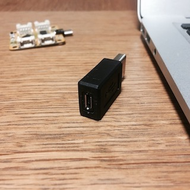

# Waffleとは
スマホにセンサをつなげて、計測データをスマホに送信することができます。


## Waffle基板にセンサを接続する

はんだ付けしなくても使えるように Groveセンサ を使えるようにしました。


### Groveセンサ
Groveセンサについてはこちらを参照してください。

[Grove System](http://wiki.seeed.cc/Grove_System/)

日本でセンサ購入する場合、たとえば下記を参照してみてください。

[Switch Science: Groveセンサ](https://www.switch-science.com/catalog/list/379/)

出荷時には、Grove Analogセンサーの値を読み取れるようにプログラムを書き込んであります。Grove AnalogセンサーをA0につなぐことで、スマホと連携することができます。

### ピンアサイン
基板のピンアサイン(コネクタと入出力データの関係)はこちらの写真を参照してください。


センサをA0に接続し、マイクロUSBコネクタをスマホに接続してください


## Waffle Androidアプリについて


### サンプルアプリ
こちらからサンプルアプリをダウンロードすることができます。

<a href='http://play.google.com/store/apps/details?id=com.luckyblaze.waffle&pcampaignid=MKT-Other-global-all-co-prtnr-py-PartBadge-Mar2515-1'></a>

アプリを起動して、Waffle基板がAndroidスマホにつながっている状態で、右上の「DISCONNECTED」の部分をタップしてください。接続確認ダイアログが出るので、OKをタップすると、Waffle基板からのテキストデータ受信を開始します。


画面下のタブバーから「Text」を選択すると、受信したJSON形式のテキストデータをそのまま表示します。「Bar Chart」を選択すると、受信した0-1023の値を0-100として表示します。


Androidのソースコードについては、こちらを参考にしてください。

[Waffle Android Source Code](Android/Waffle/)

### 通信のしくみ
Androidとの連携は、シリアル通信を利用しています。

```
Waffle → テキストデータ(JSON) → Androidスマホ
```

WaffleからJSON形式のテキストデータを送信しています。Androidアプリで受け取ったJSON形式のテキストを解析(パース)して、数値を読み取っています。


## Waffle 基板をハックしよう
Waffle基板はArduino互換機です。Arduinoをご存知の方は、Arduinoと同じように使うことができます。

### Arduino として使うには
USBでPC/Macにつなぐ際には USB-シリアル変換プラグ が必要となります。

 


基板は Arduino Duemilanove と同じ構成にしています。オリジナルのプログラムを書き込むには、PC/Mac で Arduino アプリを起動します。


ボードの選択画面で、Arduino Duemilanove を選択してください。


シリアルポートの変更も忘れずに！(写真は一例になります。番号はお手持ちの基板によって異なります。)


### 回路図
回路図はこちらです。構成は Arduino Duemilanove と同じです。


### Arduinoソースコード
出荷時には、A0コネクタの値をスマホへ送信するプログラムを書き込んでいます。Arduinoのソースコードについては、こちらにあります。いろいろ書きこんだ後で、プログラムを出荷時に戻したくなった場合は、こちらのコードを書き込んでください。

なお、本コードはArduinoJsonライブラリを使用しています。Arduino IDE上で、スケッチ->ライブラリをインクルード->ライブラリを管理...をクリック。すると、ライブラリマネージャが起動するので、ArduinoJsonライブラリを検索し、インストールしてください。

[Waffle Arduino Source Code](Arduino/Waffle_Test/)

Let's tinkering!

## コピーライト
Keisuke Suzukiさんの[PocketDuino](http://www.physicaloid.com/product/pocketduino/)/[Physicaloid](https://github.com/ksksue/PhysicaloidLibrary)を参考にしています。


## ライセンス
Waffle is released under the [Apache License, Version 2.0](http://www.apache.org/licenses/LICENSE-2.0).
